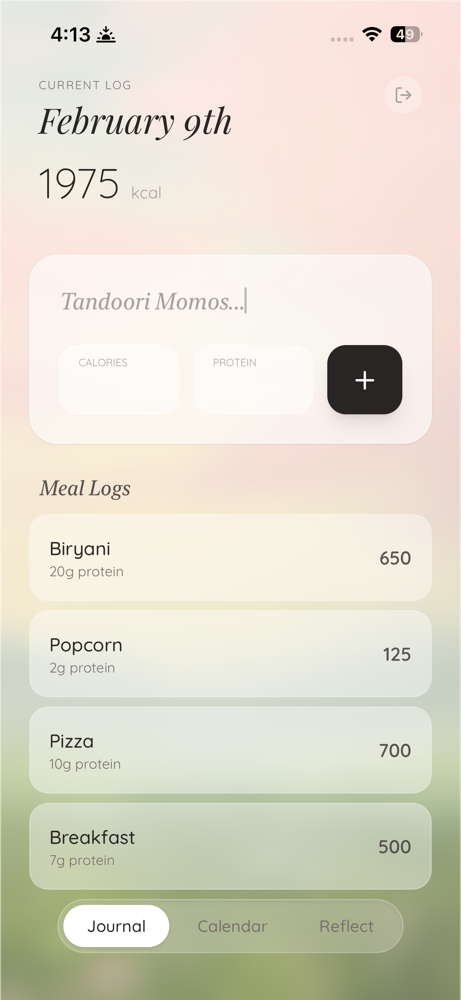

# SkyCal

**Your daily nutrition journal — designed to feel like a page from a diary, not a spreadsheet.**

Track calories and protein with a gorgeous, glassmorphic interface that looks
beautiful whether you're on your phone or your laptop.

---

## What it does

A calorie & protein tracker. Sign in with Google, log your meals, and see where you stand for the day. That's it.

&nbsp;&nbsp;&nbsp;&nbsp;

---

## How it works

**Journal** — Pick a date, type what you ate, punch in calories & protein, hit `+`. Done. Your entries show up below with a running total and a progress bar against your daily goal.

**Calendar** — A month view where each day gets a green or red dot depending on whether you stayed under your limit. Tap a day to jump to its logs.

**Reflect** — Weekly and monthly analytics. A line chart of your daily intake, deficit/surplus tracking, average protein, and a day-by-day breakdown. On desktop this expands into a full multi-panel dashboard with navigable weeks, a monthly heatmap calendar, and a yearly overview.

**Email alerts** — A daily cron job checks if you went over your limit the previous day and sends an email notification via EmailJS. Accountability on autopilot.

**Settings** — Customizable daily calorie goal and maintenance calories, saved per-user in Firestore.

---

## Under the hood

- **Real-time sync** — Firestore `onSnapshot` listeners. Add a meal on your phone, see it appear on your laptop instantly.
- **Separate mobile & desktop components** — Not just CSS breakpoints. SkyCal renders `MobileApp` or `DesktopApp` as entirely different component trees based on screen width. Same props, different UX.
- **Serverless cron** — The daily calorie check runs as a Vercel Serverless Function triggered by Vercel Cron. It authenticates against Firestore using a manually signed JWT (no `firebase-admin` SDK — too heavy for serverless).
- **Swipe gestures** — Meal entries use Framer Motion's drag API with spring physics. Swipe right → delete, swipe left → edit. Thresholds and velocity detection make it feel native.

---

## Design & small details

- **Glassmorphic UI** — Frosted glass panels over a soft pink sky background. Different images for mobile and desktop.
- **Spring animations** — Page transitions, nav pill, entry cards — everything uses Framer Motion spring physics.
- **Typography** — Playfair Display (serif) for headings, Quicksand (sans) for body. Gives it a journal-like feel.
- **Blinking cursor** — The food input has a CSS-animated cursor blinking after the placeholder *"Tandoori Momos..."*. A tiny thing that makes the empty state feel alive.
- **Live IST clock** — The desktop header shows a ticking clock in Indian Standard Time.
- **Color-coded calendar dots** — Green = under limit, red = over. Simple visual at-a-glance.

---

## 🛠 Tech Stack

| Layer | Tech |
|---|---|
| **Frontend** | React 19, Tailwind CSS, Framer Motion |
| **Backend** | Firebase (Auth + Firestore) |
| **Hosting** | Vercel (with Serverless Functions) |
| **Cron Jobs** | Vercel Cron → Serverless API route |
| **Email** | EmailJS |
| **Build** | Rolldown-Vite |
| **Fonts** | Playfair Display + Quicksand |
| **Icons** | Lucide React |

---

*~ made with love by satvik ~*

